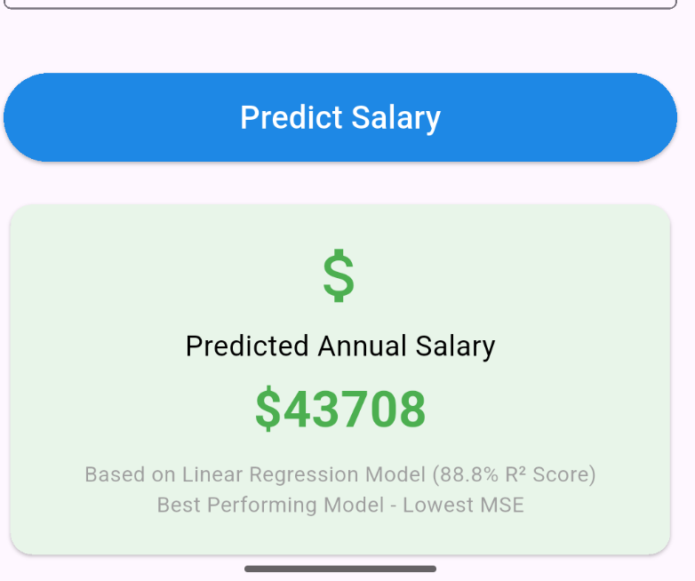

# International Graduates Salary Prediction System

## Mission Statement
Empowering international students with data-driven career insights through machine learning salary predictions. This system bridges critical information gaps in global education decisions, addressing employment uncertainty for international graduates. My solution enables students to maximize their educational investment returns through predictive analytics, providing actionable insights for informed career planning and strategic educational choices.

## Dataset Description
**Source:** [International Graduates Employment Dataset - Kaggle](https://www.kaggle.com/datasets/quackquackrp/international-graduates-employment-dataset)  
**Volume:** 300,000+ anonymized records of international graduates across multiple countries  
**Variety:** Comprehensive dataset combining graduate-outcomes survey data with visa, language, and academic information from authoritative sources including UK HESA Graduate Outcomes Survey and Eurostat EU Labour Force Survey. Features include Education Level, Field of Study, Language Proficiency, Visa Type, University Ranking, Region of Study, Age, and Years Since Graduation.

## Key Visualizations

### Correlation Heatmap


**Key Insights:**
- **Education Level:** Strongest predictor (0.893 correlation) - PhD graduates earn 2.6x more than Diploma holders
- **Language Proficiency:** Moderate impact (0.120 correlation)
- **Years Since Graduation:** Minor impact (0.061 correlation)
- **University Ranking:** Minor impact (0.060 correlation)

### Model Performance Comparison


**Results:**
- **Best Model:** Linear Regression (Lowest MSE: 36,009,030)
- **Test R² Score:** 88.77% variance explained
- **Selection Criteria:** Lowest loss with high interpretability

## Live API Endpoint
**API URL:** https://international-graduates-salary-api.onrender.com  
**Swagger Documentation:** https://international-graduates-salary-api.onrender.com/docs  
**Health Check:** https://international-graduates-salary-api.onrender.com/health  
**Status:** LIVE & DEPLOYED

### API Usage Example
```bash
curl -X POST "https://international-graduates-salary-api.onrender.com/predict" \
-H "Content-Type: application/json" \
-d '{
  "education_level": "Master'\''s",
  "field_of_study": "Engineering",
  "language_proficiency": "Fluent",
  "visa_type": "Work Visa",
  "university_ranking": "High",
  "region_of_study": "UK",
  "age": 28,
  "years_since_graduation": 3
}'
```

## Demo Video
**YouTube Link:** [5-Minute Demo Video](https://youtu.be/TKC4TgPqrxU)

## Mobile App Instructions

### Prerequisites
- Flutter SDK 3.1.0+
- Android Studio or VS Code
- Android device/emulator or iOS simulator

### Setup & Run
```bash
# 1. Clone repository
git clone https://github.com/Chol1000/linear_regression_model.git

# 2. Navigate to Flutter app
cd linear_regression_model/FlutterApp/flutter_app

# 3. Install dependencies
flutter pub get

# 4. Run on device/emulator
flutter run
```

### App Features
 

- **8 Input Fields:** Education Level, Field of Study, Language Proficiency, Visa Type, University Ranking, Region of Study, Age, Years Since Graduation
- **Real-time Predictions:** Direct API integration with loading states
- **Data Validation:** Range constraints (Age: 18-65, Years: 0-40)
- **Cross-platform:** Works on Android and iOS
- **Professional UI:** Material Design 3 with responsive layout

### Troubleshooting
- **Android:** App automatically uses `10.0.2.2` for emulator API access
- **iOS:** App uses `localhost` for simulator API access
- **Network Issues:** Check internet connection and API status at `/health` endpoint

## Project Structure
```
linear_regression_model/
├── API/
│   ├── prediction.py           # FastAPI application
│   ├── requirements.txt        # Python dependencies
│   └── render.yaml            # Deployment configuration
├── FlutterApp/flutter_app/     # Complete mobile application
│   ├── lib/main.dart          # Main application code
│   └── pubspec.yaml           # Flutter dependencies
├── linear_regression/
│   ├── multivariate.ipynb     # ML pipeline & analysis
│   ├── predict_salary.py      # Prediction script
│   ├── models/                # Saved models & preprocessors
│   └── dataset.csv           # Training dataset (300K+ records)
└── images/                   # Screenshots & visualizations
```

## Technical Highlights
- **Non-Generic Use Case:** International graduate salary prediction for career guidance
- **Rich Dataset:** 300K+ records with 8 meaningful features across multiple countries
- **Best Model Selection:** Linear Regression chosen for lowest MSE (36,009,030)
- **Production Ready:** Live API with comprehensive validation and error handling
- **Cross-Platform Mobile:** Flutter app with professional UI and real-time predictions

---
*Empowering international graduates through data-driven career insights.*